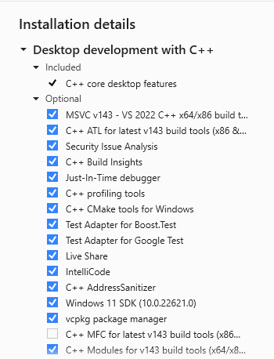

## Visual Studio and Ninja Multi-Config Build Instructions

The build use CMake for build system generation and Conan 2 for dependency management.  Prerequisites for building are:
 - A supported C++ compiler
   * GCC, 11.x and later
   * Clang, 14.x and later
   * MSCV, 2022 and later
 - Python
 - Git

Visual Studio 2022 can be downloaded from Microsoft [website](https://visualstudio.microsoft.com/vs/community/)
A minimum working installation to support the project build will have the following details:


In general you can use your own [Conan profile](https://docs.conan.io/2/reference/commands/profile.html) but the project ships with profiles for all supported configurations. I you use your own profile then ensure that if you are building again libstdc++ with GCC or Clang that you build on the C++11 and onwards version. To do so insert the following into your Conan profile under the `[settings]` section:

```
compiler.libcxx=libstdc++11
```

However, preferably use one of the pre-installed configurations in `<project root>/.conan/profiles` (which are installed via the `conan config install ./conan` command to the local conan configuration folder ./.conan2 as specified in the ./.conanrc file) as these are tested and known to work.

### Cloning the Repo

To clone the repo use git to clone the repository to your local machine:

```bash
git clone https://github.com/Twon/Morpheus.git
```

### Configuring Conan

To set up Conan for the repository create a repository local virtual environment for Python and [activate the environment (note this step differs for different shells)](https://docs.python.org/3/library/venv.html#how-venvs-work)
For Windows build with Visual Studio run the [Developer Command Prompt for Visual Studio 2022](https://learn.microsoft.com/en-us/visualstudio/ide/reference/command-prompt-powershell?view=vs-2022#start-in-visual-studio)

```bash
cd <project root>
python -m venv .venv                # Create a Python virtual env
.venv\Scripts\activate.bat          # Activate the virtual env for bash by source.
pip install -r ./requirements.txt   # Install all Python dependecies
conan profile detect --force        # Generate a default configuration with the local machine settings
conan config install ./.conan       # Install supported build profiles from ./.conan to ./conan2
```

### Multi-Config Build

Multi-config builds allow you to create a build folder containing sub-folders for different build configurations and build them side-by-side. Once again starting with the repository clone and Conan configured run the install stage, but this time we specity the Conan cmake tools use Ninja multi-config to generate `Release, Debug, RelWithDebInfo` configurations.  To generate all 3 configuration we run the `conan-default` preset which configures CMake for these configurations.

```bash
conan install ./ -pr:h .conan2/profiles/msvc/193/x64-release -pr:b .conan2/profiles/msvc/193/x64-release --build missing -c tools.cmake.cmaketoolchain:generator="Ninja Multi-Config"
source build/generators/conanbuild.sh # Access the environment variables needed to use the Mold linker with gcc and clang
cmake --preset conan-default  # The configure stage for multi-config builds is conan-default
```

Now with CMake configured we select the preset conresponding to the configuration we want to build, in this case the `Release` configuration.
```bash
cmake --build --preset conan-release # The build stage for multi-config builds is the conan-<configuration>
```
